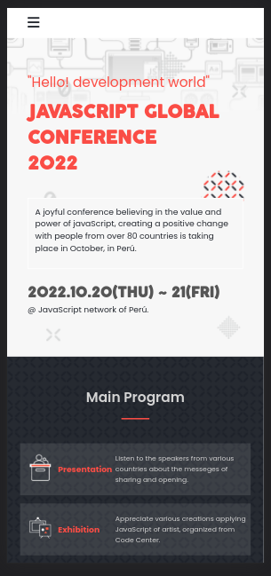

# HTML, CSS, and JavaScript Capstone Project

>	This is my HTML, CSS, and JavaScript capstone project .

## Built With

- HTML, CSS and JavaScript.

## Live Demo

[Live Demo Link](https://andres-condezo.github.io/html_capstone/)

## Learning objectives

- Use semantic HTML tags.
- Apply best practices in HTML code.
- Use CSS selectors correctly.
- Use CSS box model.
- Use Flexbox to place elements in the page.
- Demonstrate ability to create UIs adaptable to different screen sizes using media queries.
- Use GitHub Pages to deploy web pages.
- Apply JavaScript best practices and language style guides in code.
- Use JavaScript to manipulate DOM elements.
- Use JavaScript events.
- Use objects to store and access data.
- Communicate technical concepts to other technical people.

## Getting Started

- In order to see the web pagein your browser you must click on the "Live Demo" link.
- To get a local copy up and running follow these simple example steps:

### Prerequisites

No prerequisites are necessary for this project

### Setup

- Clone the repository with the command:

<code>
$ git clone https://github.com/andres-condezo/html_capstone.git
</code>

### Usage
- Open the file named 'index.html' in your browser.

## Authors

👤 **Andrés Condezo Monge**

- GitHub: [@andres-condezo](https://github.com/andres-condezo)
- Twitter: [@andres_condezo](https://twitter.com/andres_condezo)
- LinkedIn: [andres-condezo](https://linkedin.com/in/andres-condezo)

## Show your support

Give a ⭐️ if you like this project!

## Acknowledgments

- Original design idea by [Cindy Shin](https://www.behance.net/adagio07).

## 📝 License

This project is [MIT](./MIT.md) licensed.
